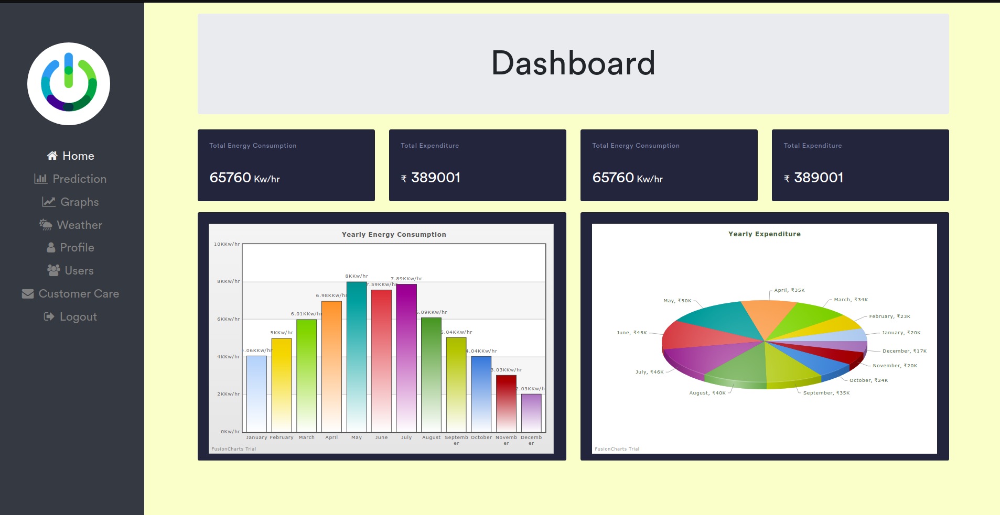
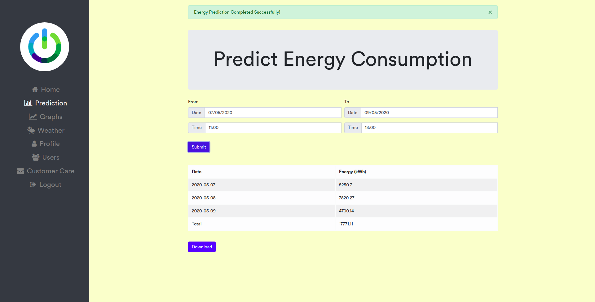
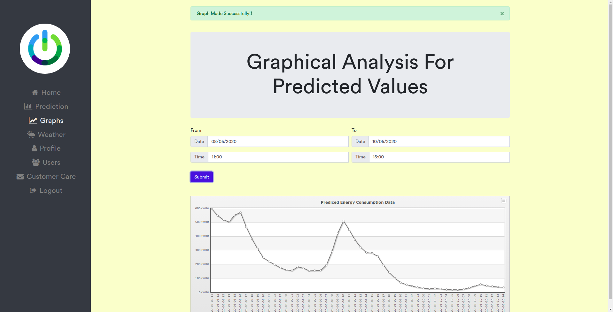
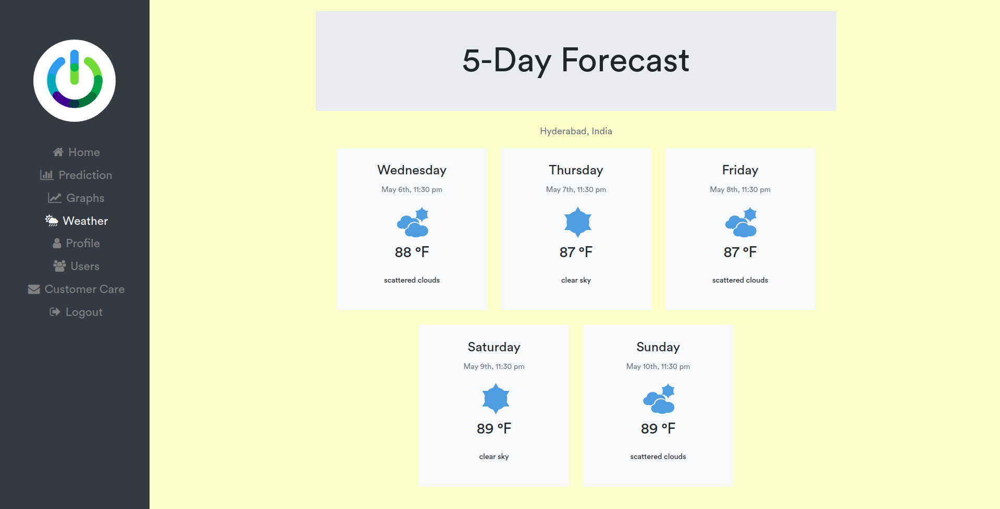

# Energy Prediction Webapp
This is a energy prediction webapp which uses Facebook's Prophet Algorithm along with some additional regressors like temperature and holiday to predict the future energy consumption. You can predict energy consumption values, get graphical analysis of energy prediction values, download the predicted data, see 5 day weather forecast and email customer care for your issues using the webapp.

## Technologies Used
* Webapp using **MERN** stack
* Machine Learning Algorithm Used : [Facebook's Prophet Algorithm](https://facebook.github.io/prophet/docs/quick_start.html)
* API for getting temperature prediction: Open Weather API
* API for fetching live data for dashboard: Google Spreadsheet API

## File Structure
* **src/model:** contains code to train machine learning models.
* **src/webapp:** contains code of MERN based webapp.
* **data:** contains training data.
* **diagrams:** contains UML diagrams.
* **documents:** contains SRS, Project Plan, Design document, Test plan document and various other documents related to our system.

* **Dashboard showing live energy consumption statistics of a complex**

* **Prediction page showing the values of energy consumption prediciton.**

* **Showing prediction values in graphical form**

* **Showing 5-day weather prediction.**

