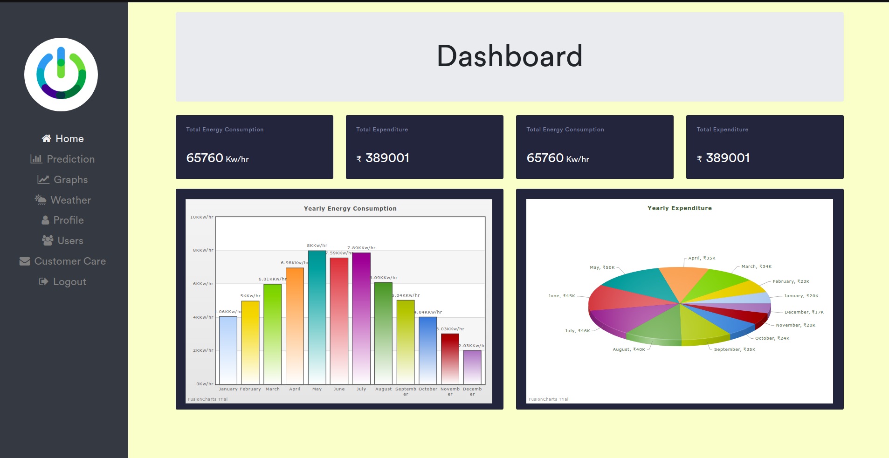

# Energy Prediction Webapp
This is a energy prediction webapp which uses Facebook's Prophet Algorithm to predict the future energy consumption. You can predict energy consumption values, get graphical analysis of energy prediction values, download the predicted data, see 5 day weather forecast and email customer care for your issues using the webapp.
* **src/model:** contains code to train machine learning models.
* **src/webapp:** contains code of MERN based webapp.
* **data:** contains training data.
* **diagrams:** contains UML diagrams.
* **documents:** contains SRS,Project Plan, Design document, test plan document and various other documents related to our system.

